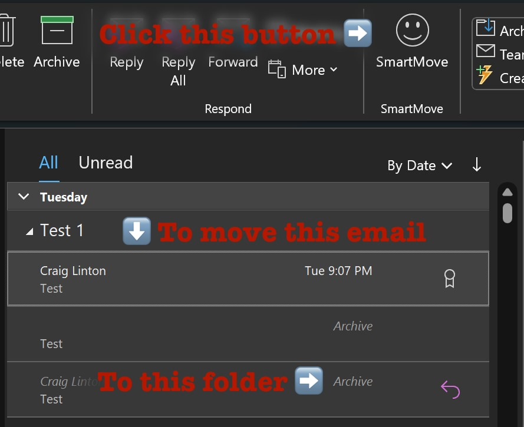

# smartmove
A VBA macro for Outlook that moves the selected email to the same folder as the first email in the conversation

**1. Macro Security Settings**

  Ensure that macros are enabled in Outlook. Go to _File_ > Options > Trust Center > Trust Center Settings > Macro Settings. Choose a setting like "Notifications for all macros" or "Enable all macros" (the latter is less secure).

**2. Create a New Macro**

  - In Outlook, press Alt + F11 to open the VBA editor.
  - Insert a new module and paste the text from smartmove.vb.

**3. Create a Custom Group in the Ribbon**

  To add a custom button to the ribbon, you need to create a custom group:
  
  - Right-click the Ribbon: Right-click anywhere on the ribbon and select Customize the Ribbon.
  - Create a New Group: Choose where you want the button (like the Home tab), click New Group, and then Rename to give your group a name.
  - Add a New Tab (Optional): If you prefer, you can add a new tab instead of a group in an existing tab.

**4. Add the Macro to the Ribbon**

  Now, you can add the macro to the newly created group:
  
  - Choose Macros from the Choose commands from menu: On the left side of the Customize the Ribbon window, select Macros from the dropdown menu.
  - Select Your Macro: Find and select the macro you created.
  - Add to Custom Group: Click Add to move your macro to the custom group on the right side.
  - Rename and Modify the Button: Select the macro in the right pane, click Rename, and choose an icon and a display name for your button.
  - Save Your Changes: Click OK to save your changes.

*ChatGPT wrote these instructions and the code for smartmove.vb.*
